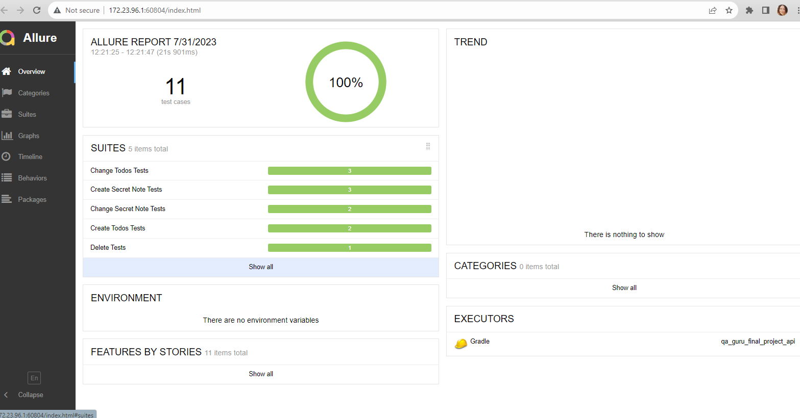
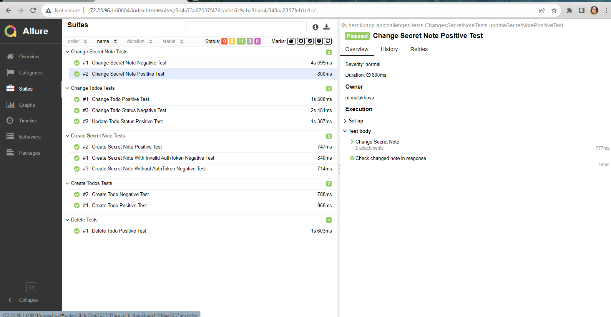
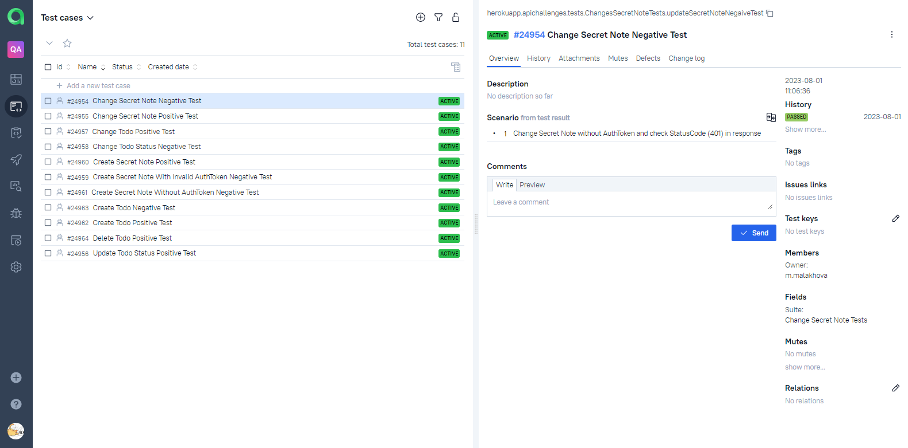
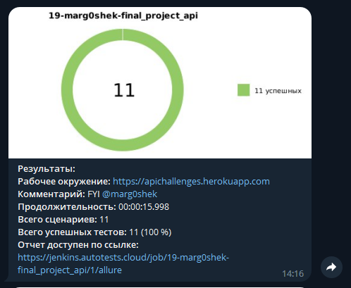

# Дипломный проект по автоматизации тестирования (API)

## 	Содержание

> ➠ [API сервис Apichallenges Herokuapp](#api-сервис-apichallenges-herokuapp)
>
> ➠ [Технологический стек API](#технологический-стек-api)
> 
> ➠ [Удаленный запуск тестов в Jenkins](#-запуск)
>
> ➠ [Отчет о результатах тестирования в Allure Report](#-главная-страница-allure-отчета)
>
> ➠ [Tests as documentation в Allure Test Ops](#-тест-кейсы-в-allure-test-ops)
>
> ➠ [Уведомления в Telegram с использованием бота](#-уведомления-в-telegram-с-использованием-бота)

## API сервис Apichallenges Herokuapp
###  Покрытый функционал api сервиса Apichallenges Herokuapp

> Разработаны автотесты на <code>Api сервис</code>.
### Api

- [x] Создание Todo
- [x] Изменение Todo
- [x] Создание Secret Note
- [x] Изменение Secret Note
- [x] Удаление Todo

### Технологический стек API

### В данном подпроекте автотесты написаны на <code>Java</code> с использованием <code>Rest Assured</code> для Api-тестов.
>
> <code>Rest Assured</code> выполняет роль обёртки над http клиентом.
>
> <code>Allure Report</code> формирует отчет о запуске тестов.
>
> Для автоматизированной сборки проекта используется <code>Gradle</code>.
>
> В качестве библиотеки для модульного тестирования используется <code>JUnit 5</code>.
>
> <code>Jenkins</code> выполняет запуск тестов.
>
> После завершения прогона отправляются уведомления с помощью бота в <code>Telegram</code>.

##  Запуск

Ссылка на Jenkins Job: <code>https://jenkins.autotests.cloud/job/19-marg0shek-final_project_api/</code>

##  Главная страница allure отчета

###  Группировка тестов по проверяемому функционалу

###  Тест кейсы в Allure Test Ops

##  Уведомления в Telegram с использованием бота

> После завершения сборки специальный бот, созданный в <code>Telegram</code>, автоматически обрабатывает и отправляет сообщение с отчетом о прогоне.
>
> Информация по настройке и использованию бота <code>https://github.com/qa-guru/allure-notifications</code>

